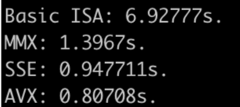

# Lab4 面向特定应用的体系结构优化

## 使用 x86 SIMD 指令对应用程序进行优化并分析

在该项目中，使用C++语言实现了单幅 YUV 图像淡入淡出处理程序，然后通过 MMX、SSE 和 AVX 三个指令集对 YUV 图像淡入淡出程序进行了优化。

### 编译

项目使用 cmake 管理，**要求编译器支持 C++ 17，以及3.16版本以上的cmake**。且只支持 GCC 和 Clang 编译器，未对 MSVC 编译器提供支持。每个指令集对应代码由 Intel Intrinsics 实现，并通过 GCC 或 Clang 的 pragma 控制了每个实现编译器可用的指令集，避免了编译器进行自动向量化。通过 `objdump `可以看到对四种实现分别生成了 x87 FPU、MMX、SSE 和 AVX 指令。

外部依赖 https://github.com/jamolnng/argparse ，已被集成至代码库。

编译方式：

```shell
$ mkdir build && cd build && cmake .. -DCMAKE_BUILD_TYPE=Release && make -j 4
```

### 运行示例

读入 `dem1.yuv` 文件并进行性能评测。（<EXE File>为可执行文件名，目前是`./lab4_new`）

```shell
$ <EXE File> -f dem1.yuv[path] -s 1920x1080 -m benchmark
```

读入 `dem1.yuv` 文件，使用 SSE 指令集进行处理，并将视频输出为 `dem1o.yuv`。

```shell
$ <EXE File> -f dem1.yuv[path] -o dem1o.yuv -s 1920x1080 -i sse
```

读入 `dem1.yuv` 文件并验证 AVX 指令集处理程序的正确性（与 Baseline 实现进行对比）。

```shell
$ <EXE File> -f dem1.yuv[path] -s 1920x1080 -m validate -i avx
```

参数的详细定义请查看

```shell
$ <EXE File> -h
```

### 代码结构

本节简要介绍程序代码的组织方式。算法的主要实现位于 `Rgb888.*` 和 `Yuv420pFrame.*` 中。

`Rgb888::fromYuv420(const Yuv420pFrame &input)` 函数模版使用 `ExecutePolicy` 类型的模版参数来选择算法，并已对 `ExecutePolicy::MMX`，`ExecutePolicy::SSE` 和 `ExecutePolicy::AVX` 进行了特化，该函数模版实现了 YUV420p 格式的图像到 RGB888 格式图像的转化。

`Yuv420pFrame::fromAlphaMixingRgb888(const Rgb888 &input, int alpha)` 函数模板选择算法的方式同上，该模版实现了 RGB888 图像的 alpha 混合和到 YUV420p 格式图像的转化。

`Yuv420pFrame::fromFile` 和 `Yuv420pFrame::appendToFile` 函数实现了对单帧 YUV420p 图像的读写。

在 `Yuv420pVideo.*` 文件中实现了对一段 YUV420p raw video 文件的读写。

### 算法

#### Basic ISA

本步骤按照实习说明，由C++进行实现。实习说明中未提到由 RGB 转化回 YUV420p 时对 U 和 V 分量的降采样，这里采用四个像素的平均值进行。

#### MMX

MMX 指令集提供了64位宽的packed integer的处理。由于它只能处理整数数据，并没有浮点支持，查阅资料可知一般的做法是将浮点数乘以一个较大的整数，转化为整数计算，最后再将整数转化回浮点数。这样做会损失精度。在我们的测试中发现 RGB 转化为 YUV 最终精度为 $\pm 1$ 的差距。YUV 转化为 RGB 难以在较高性能下实现较高的精度，故未实现，并直接采用了 Basic ISA的算法。我们注意到 RGB 转化为 YUV 会执行 85 次，而 YUV 转化为 RGB 只需要进行一次，故根据 Amdahl 定律，放弃该部分优化并不会造成很大的性能损失。

RGB 转 YUV 的公式如下

$Y = (8141 * R + 16519 * G + 3208 * B)/ 32768 + 16$

$U = (-4856 * R - 9535 * G + 14392 * B) / 32768 + 128$

$V = (8414 * R + 16519 * G + 3208 * B) / 32768 + 128$

计算时 R，G，B 和常数部分作为四个16bit整数放在一个64位整数向量中，首先利用 `_m_pmullw` intrinsic 实现 alpha 混合，利用 `_m_pmaddwd` intrinsic 与系数相乘并部分相加，再利用 `_m_to_int64` 转化为 `int64_t` 类型，将高 32 位和低 32 位相加即可算出 Y、U、V。

为了转化为 YUV420p 格式，我们还需要对 U 和 V 进行降采样。

代码请见 `Yuv420pFrame_mmx.cpp:Yuv420pFrame::fromAlphaMixingRgb888<MMX>(const Rgb888 &input, int alpha)`。

#### SSE

SSE 指令集提供了 128 位宽的整数和浮点数向量的处理。

YUV 转化为 RGB 的方法如下：

我们一次对 2 * 8 的区域进行转化。代码中的 y1-y4 向量分别存储了2 * 2格子中的 y 值。该值均对应相同的 u 和 v 值，这些 u 和 v 值会由 `_mm_set1_ps` 放在单个向量中，这些向量分别乘以系数并相加即可得到每个像素的 r、g、b值。这些值由 `_mm_extract_epi32` 取出保存到对应位置。算法比较直接，代码详见 `Rgb888_sse.cpp:Rgb888::fromYuv420<SSE>(const Yuv420pFrame &input)`。

将RGB 进行 alpha 混合并转为 YUV 的方法（不包括降采样）如下：

在一个128位向量中将 R、G 和 B 分量作为单精度浮点数读入，然后利用 `_mm_dp_ps` intrinsic 与系数相乘，结果由 `_mm_cvtss_si32` intrinsic 转化回整数，即可得到 Y、U 和 V 分量。 代码详见 `Yuv420pFrame_sse.cpp:Yuv420pFrame::fromAlphaMixingRgb888<SSE>(const Rgb888 &input, int alpha) `

YUV 降采样的方法如下：

我们一次对 2 * 16 的区域进行降采样。首先由 `_mm_load_si128` intrinsic 读入两个 1 * 16 的区域，写入两个 `__m128i` 型的向量中，再利用 `_mm_unpackhi_epi8` 和 `_mm_unpacklo_epi8` 将向量中的 8bit 数值转化为 16bit 数值。利用 `_mm_hadd_epi16` intrinsic 将每个向量中相邻的数值相加（这些值最终会被降采样到一个 U/V 值中）得到两个 8\*16 bit 向量。将这两个向量相加得到一个 8\*16 bit 向量，该向量中的值即为每个 block 中四个像素的 U/V 值的和。对该向量中每个值右移两位即得到平均值。利用 `_mm_shuffle_epi8` 将该 8\*16 bit 向量压缩到一个 16\*8 bit 向量的低位中，利用 `_mm_extract_epi64` 取出低位并写入结果。若一行的像素不是 16 的倍数，则多出的部分直接利用最原始的公式一一计算。代码详见`Yuv420pFrame_sse.cpp:Yuv420pFrame::fromAlphaMixingRgb888<SSE>(const Rgb888 &input, int alpha) `。

#### AVX

使用 AVX 指令集的实现与使用 SSE 指令集的实现相近，仅仅是使用了更长的向量，同时处理更多的数据。有些指令如 `_mm256_unpackhi_epi8` 相当于在其高低位上分别进行了 `_mm_unpackhi_epi8` ，而非直接将 `_mm_unpackhi_epi8` 的语义扩展到更长的向量上去，因此不能直接进行替换，需要对算法进行微调。由于主要算法并无变化，这里不再详述，详情请见代码`Yuv420pFrame_avx.cpp:Yuv420pFrame::fromAlphaMixingRgb888<AVX>(const Rgb888 &input, int alpha) `。

### 性能评测

测试环境：`Ubuntu 18.04 LTS，Intel Core i7-7700 4c8t @ 3.6GHz，64GB RAM`。编译器为` gcc 7.5.0`。我们分别使用四种指令集进行10次转化（1次 YUV2RGB，85次ARGB2YUV）得到平均时间。

程序运行结果截图：



### 分析

在速度上 AVX > SSE > MMX > Basic ISA。由于 Basic ISA、MMX 和 SSE 及 AVX 的算法有较大差异，我们难以直接分析影响性能的因素，因此我们主要关注 SSE 和 AVX。我们发现 AVX 并未达到 SSE 的两倍性能，这是因为我们并不能将全部代码都并行化，还有一些如访存等指令只能部分并行。

在实现过程中我调整过多次实现，对 RGB2YUV 的算法的访存模式进行了多次调整，并考虑了 x86-64 体系结构只拥有 16 个 `xmm/ymm` 寄存器，因此尽量减少了寄存器溢出的情况，同时达到了较大的并行度。但很显然尚未达到最优。这也说明对 SIMD 程序的优化是一个困难的工作。


## 设计自定义扩展指令对 SIMD 应用优化并分析

### 指令设计

__[指令定义]__

| Instruction | Type | Description |
| ---- | ---- | ---- |
| **存取** |      |      |
| vlp rd, offset(rs1) | I | R[rd] <- Mem(R[rs1] + offset, packed 256 bit) |
| vsp rs2, offset(rs1) | S | Mem(R\[rs1 + offset\]) <- R\[rs2\]\[255:0\] |
| **packed运算** |  |  |
| vaddpb rd, rs1, rs2 | R | packed 8-bit integer add |
| vaddph rd, rs1, rs2 | R | packed 16-bit integer add |
| vaddpw rd, rs1, rs2 | R | packed 32-bit integer add |
| vaddps rd, rs1, rs2 | R | packed single-precision floating-point add |
| vsubpb rd, rs1, rs2 | R | packed 8-bit integer sub |
| vsubph rd, rs1, rs2 | R | packed 16-bit integer sub |
| vsubpw rd, rs1, rs2 | R | packed 32-bit integer sub |
| vsubps rd, rs1, rs2 | R | packed single-precision floating-point sub |
| vmullpb rd, rs1, rs2 | R | multiply the packed signed 8-bit integer in rs1 and rs2, producing intermediate 16-bit integers, and store the low 8 bits of the intermediate integers in rd |
| vmulhpb rd, rs1, rs2 | R | multiply the packed signed 8-bit integer in rs1 and rs2, producing intermediate 16-bit integers, and store the high 8 bits of the intermediate integers in rd |
| vmullph rd, rs1, rs2 | R | multiply the packed signed 16-bit integer in rs1 and rs2, producing intermediate 32-bit integers, and store the low 8 bits of the intermediate integers in rd |
| vmulhph rd, rs1, rs2 | R | multiply the packed signed 16-bit integer in rs1 and rs2, producing intermediate 32-bit integers, and store the high 8 bits of the intermediate integers in rd |
| vmullpw rd, rs1, rs2 | R | multiply the packed signed 32-bit integer in rs1 and rs2, producing intermediate 64-bit integers, and store the low 8 bits of the intermediate integers in rd |
| vmulhpw rd, rs1, rs2 | R | multiply the packed signed 32-bit integer in rs1 and rs2, producing intermediate 64-bit integers, and store the high 8 bits of the intermediate integers in rd |
| vmulps rd, rs1, rs2 | R | packed single-precision floating-point multiply |
| **饱和计算** |  |  |
| vaddspb rd, rs1, rs2 | R | packed 8-bit integer add using saturation |
| vaddsph rd, rs1, rs2 | R | packed 16-bit integer add using saturation |
| vaddspw rd, rs1, rs2 | R | packed 32-bit integer add using saturation |
| vsubspb rd, rs1, rs2 | R | packed 8-bit integer sub using saturation |
| vsubsph rd, rs1, rs2 | R | packed 16-bit integer sub using saturation |
| vsubspw rd, rs1, rs2 | R | packed 32-bit integer sub using saturation |
| vmaxspb rd, rs1, rs2 | R | compare packed signed 8-bit integers in rs1 and rs2, store packed maximum values in rd |
| vmaxupb rd, rs1, rs2 | R | compare packed unsigned 8-bit integers in rs1 and rs2, store packed maximum values in rd |
| vmaxsph rd, rs1, rs2 | R | compare packed signed 16-bit integers in rs1 and rs2, store packed maximum values in rd |
| vmaxuph rd, rs1, rs2 | R | compare packed unsigned 16-bit integers in rs1 and rs2, store packed maximum values in rd |
| vmaxspw rd, rs1, rs2 | R | compare packed signed 32-bit integers in rs1 and rs2, store packed maximum values in rd |
| vmaxupw rd, rs1, rs2 | R | compare packed unsigned 32-bit integers in rs1 and rs2, store packed maximum values in rd |
| vmaxps rd, rs1, rs2 | R | compare packed single-precision floating-points in rs1 and rs2, store packed maximum values in rd |
| vminspb rd, rs1, rs2 | R | compare packed signed 8-bit integers in rs1 and rs2, store packed minimum values in rd |
| vminupb rd, rs1, rs2 | R | compare packed unsigned 8-bit integers in rs1 and rs2, store packed minimum values in rd |
| vminsph rd, rs1, rs2 | R | compare packed signed 16-bit integers in rs1 and rs2, store packed minimum values in rd |
| vminuph rd, rs1, rs2 | R | compare packed unsigned 16-bit integers in rs1 and rs2, store packed minimum values in rd |
| vminspw rd, rs1, rs2 | R | compare packed signed 32-bit integers in rs1 and rs2, store packed minimum values in rd |
| vminupw rd, rs1, rs2 | R | compare packed unsigned 32-bit integers in rs1 and rs2, store packed minimum values in rd |
| vminps rd, rs1, rs2 | R | compare packed single-precision floating-points in rs1 and rs2, store packed minimum values in rd |
| __pack&unpack__ |  |  |
| vpckhb rd, rs1, rs2 | R | convert rs1 and rs2 from packed 16-bit integers to 8-bit integers into rd |
| vpckwh rd, rs1, rs2 | R | convert rs1 and rs2 from packed 32-bit integers to 16-bit integers into rd |
| vcvtps rd, rs1 | R | convert rs1 from packed 32-bit floating-points to 32-bit integers into rd |
| vunpcklb rd, rs1, rs2 | R | store the higher 128-bits of rs1 and rs2 in the size of 8-bits into rd alternately |
| vunpckhb rd, rs1, rs2 | R | store the higher 128-bits of rs1 and rs2 in the size of 8-bits into rd alternately |
| vunpcklh rd, rs1, rs2 | R | store the higher 128-bits of rs1 and rs2 in the size of 16-bits into rd alternately |
| vunpcklw rd, rs1, rs2 | R | store the higher 128-bits of rs1 and rs2 in the size of 32-bits into rd alternately |
| vunpckhw rd, rs1, rs2 | R | store the higher 128-bits of rs1 and rs2 in the size of 32-bits into rd alternately |
| **其它** |  |  |
| vextrb rd, rs1, imm | I | store the imm number in rs1 into rd as 8-bit packed |
| vextrh rd, rs1, imm | I | store the imm number in rs1 into rd as 16-bit packed         |
| vextrw rd, rs1, imm | I | store the imm number in rs1 into rd as 32-bit packed |
| vextrs rd, rs1, imm | I | store the imm number in rs1 into rd as single precision floating-point packed |
| vmaddps rs1, rs2, imm | I | conditionally multiply the packed single-precision (32-bit) floating-point elements in a and b using the high 4 bits in imm8, sum the four products, and conditionally store the sum in dst using the low 4 bits of imm8. |
| vcvtps rd, rs1 | R | convert packed single-precision (32-bit) floating-point elements in a to packed 32-bit integers, and store the results in dst. |

__[指令编码]__

| I-Type  | imm[11:0] | rs1  | funct3 | rd   | opcode                       |
| ------- | --------- | ---- | ------ | ---- | ---------------------------- |
| bits    | 12        | 5    | 3      | 5    | 7                            |
| vlp     | offset    | rs1  | 0x0    | rd   | OP-VL (加载)                 |
| vextrb  | imm       | rs1  | 0x0    | rd   | OP-VEXTR (截取)              |
| vextrh  |           |      | 0x1    |      |                              |
| vextrw  |           |      | 0x2    |      |                              |
| vextrs  |           |      | 0x3    |      | OP-VEXTR-F (浮点截取)        |
| vmaddps | imm       | rs1  | 0x4    | rs2  | OP-VPCALC-F (packed浮点计算) |

| S-Type | imm[11:5] | rs2  | rs1  | funct3 | imm[4:0] | Opcode      |
| ------ | --------- | ---- | ---- | ------ | -------- | ----------- |
| bits   | 7         | 5    | 5    | 3      | 5        | 7           |
| vsp    | imm[11:5] | rs2  | rs1  | 0x0    | imm[4:0] | OP-VS(存储) |

| R-Type   | funct7 | rs2  | rs1  | funct3 | rd   | opcode                          |
| -------- | ------ | ---- | ---- | ------ | ---- | ------------------------------- |
| bits     | 7      | 5    | 5    | 3      | 5    | 7                               |
| vaddpb   | 0x0    | rs2  | rs1  | 0x0    | rd   | OP-VPCALC (packed计算)          |
| vaddph   |        |      |      | 0x1    |      |                                 |
| vaddpw   |        |      |      | 0x2    |      |                                 |
| vsubpb   | 0x1    |      |      | 0x0    |      |                                 |
| vsubph   |        |      |      | 0x1    |      |                                 |
| vsubpw   |        |      |      | 0x2    |      |                                 |
| vmullpb  | 0x2    |      |      | 0x0    |      |                                 |
| vmullph  |        |      |      | 0x1    |      |                                 |
| vmullpw  |        |      |      | 0x2    |      |                                 |
| vmulhpb  | 0x3    |      |      | 0x0    |      |                                 |
| vmulhph  |        |      |      | 0x1    |      |                                 |
| vmulhpw  |        |      |      | 0x2    |      |                                 |
| vaddps   | 0x0    |      |      | 0x0    |      | OP-VPCALC-F (packed浮点计算)    |
| vsubps   | 0x1    |      |      | 0x0    |      |                                 |
| vmulps   | 0x2    |      |      | 0x0    |      |                                 |
| vaddspb  | 0x0    |      |      | 0x0    |      | OP-VPCALC-S (packed饱和计算)    |
| vaddsph  |        |      |      | 0x1    |      |                                 |
| vaddspw  |        |      |      | 0x2    |      |                                 |
| vsubspb  | 0x1    |      |      | 0x0    |      |                                 |
| vsubsph  |        |      |      | 0x1    |      |                                 |
| vsubspw  |        |      |      | 0x2    |      |                                 |
| vmaxspb  | 0x0    |      |      | 0x0    |      | OP-VPCALC-M (packed大小值运算)  |
| vmaxsph  |        |      |      | 0x1    |      |                                 |
| vmaxspw  |        |      |      | 0x2    |      |                                 |
| vmaxupb  | 0x1    |      |      | 0x0    |      |                                 |
| vmaxuph  |        |      |      | 0x1    |      |                                 |
| vmaxupw  |        |      |      | 0x2    |      |                                 |
| vminspb  | 0x2    |      |      | 0x0    |      |                                 |
| vminsph  |        |      |      | 0x1    |      |                                 |
| vminspw  |        |      |      | 0x2    |      |                                 |
| vminupb  | 0x3    |      |      | 0x0    |      |                                 |
| vminuph  |        |      |      | 0x1    |      |                                 |
| vminupw  |        |      |      | 0x2    |      |                                 |
| vmaxps   | 0x0    |      |      | 0x0    |      | OP-VPCALC-MF (packed浮点大小值) |
| vminps   | 0x1    |      |      | 0x0    |      |                                 |
| vpckhb   | 0x0    |      |      | 0x0    |      | OP-VPACK (pack指令)             |
| vpckwh   |        |      |      | 0x1    |      |                                 |
| vcvtps   |        |      |      | 0x2    |      |                                 |
| vunpcklb | 0x0    |      |      | 0x0    |      | OP-VUNPCK (unpack指令)          |
| vunpcklh |        |      |      | 0x1    |      |                                 |
| vunpcklw |        |      |      | 0x2    |      |                                 |
| vunpckhb | 0x1    |      |      | 0x0    |      |                                 |
| vunpckhh |        |      |      | 0x1    |      |                                 |
| vunpckhw |        |      |      | 0x2    |      |                                 |

### 核心函数

我们首先定义一些C语言的API，来调用上述的汇编指令，因此先给出一些C语言函数声明：

- `__v256 _simd_set1_epi16 (short a)`: 先将16位整数复制16次到一片连续的地址区域，然后调用`vlp`指令将其加载到`dst`寄存器中。
- `__v256 _simd_set1_ps (float a)`: 先将32位浮点数复制8次到一片连续的地址区域，然后调用`vlp`指令将其加载到`dst`寄存器中。
- `__v256 _simd_set1_epi32 (int a)`: 先将32位整数复制8次到一片连续的地址区域，然后调用`vlp`指令将其加载到`dst`寄存器中。
- `SIMD_CALCULATE`: 与`Rgb888_avx.cpp`代码中的宏定义`AVX_CALCULATE`类似。
- `__v256 _simd_set_ps(f0, f1, f2, f3, f4, f5, f6, f7)`: 首先将一系列32位单精度浮点数保存到一个连续的数组中，然后调用`vlp`指令将它们加载到寄存器中。
- `__v256 _simd_mul_ps(a, b)`: 调用`vmulps`实现单精度浮点packed乘法。
- `__v256 _simd_dp_ps(a, b, imm8)`: 调用`vmaddps`指令，使用`imm8`中的高4位，有条件地将`a`和`b`中打包的32位单精度浮点元素相乘，对4个乘积求和，并使用`imm8`的低4位，有条件地将总和存储在`dst`中。
- `__v256 _simd_cvtps_epi32(a)`: 调用`vcvtps`指令，将`a`中的打包32位单精度浮点元素转换为打包的32位整数，并将结果存储在`dst`中。
- `__int32 _simd_extract_epi32(a, imm)`: 调用`vextrw`指令，从`a`中偏移`imm`位置处提取一个32位整数，并将结果存储在`dst`中。
- `DOWNSAMPLE`：与`Yuv420pFrame_avx.cpp`代码中的宏定义`DOWNSAMPLE`类似。

__[YUV转RGB]__

```c++
template<>
Rgb888 Rgb888::fromYuv420<(ExecutePolicy) AVX>(const Yuv420pFrame &input) {
	Rgb888 ret(input.width(), input.height());

	const auto yaddent = _simd_set1_epi16(-16);
	const auto uvaddent = _simd_set1_epi16(-128);
	const auto ycoeff = _simd_set1_ps(1.164383);
	const auto vrcoeff = _simd_set1_ps(1.596027);
	const auto ugcoeff = _simd_set1_ps(-0.391762);
	const auto vgcoeff = _simd_set1_ps(-0.812968);
	const auto ubcoeff = _simd_set1_ps(2.017232);
	const auto zeroepi32 = _simd_set1_epi32(0);
	const auto maximumepi32 = _simd_set1_epi32(255);

	for (size_t h = 0; h < ret.height_; ++h) {
		for (size_t w = 0; w < ret.width_; ++w) {
			size_t pos = h * ret.width_ + w;
			size_t halfpos = h / 2 * ret.width_ / 2 + w / 2;
			int y = input.ybuffer()[pos];
			int u = input.ubuffer()[halfpos];
			int v = input.vbuffer()[halfpos];

			int r = static_cast<int>(1.164383 * (y - 16) + 1.596027 * (v - 128) + 0.5);
			int g = static_cast<int>(1.164383 * (y - 16) - 0.391762 * (u - 128) - 							0.812968 * (v - 128) + 0.5);
			int b = static_cast<int>(1.164383 * (y - 16) + 2.017232 * (u - 128) + 0.5);
			ret.rbuffer()[pos] = roundInt(r);
			ret.gbuffer()[pos] = roundInt(g);
			ret.bbuffer()[pos] = roundInt(b);
		}
	}
    
    size_t ws = ret.width_ / 16 * 16;
	size_t hs = ret.height_ / 16 * 16;

	for (size_t h = 0; h < ret.height_; h += 2) {
		for (size_t w = 0; w < ws; w += 16) { SIMD_CALCULATE(1, 1); }
	}
	for (size_t w = ws; w < ret.width_; w += 2) {
		for (size_t h = 0; h < hs; h += 16) {
			auto halfwidth = ret.width_ / 2;
			SIMD_CALCULATE(ret.width_, halfwidth);
		}
	}
	for (size_t h = hs; h < ret.height_; ++h) {
		for (size_t w = ws; w < ret.width_; ++w) {
			size_t pos = h * ret.width_ + w;
			size_t halfpos = h / 2 * ret.width_ / 2 + w / 2;
			int y = input.ybuffer()[pos];
			int u = input.ubuffer()[halfpos];
			int v = input.vbuffer()[halfpos];

			int r = static_cast<int>(1.164383 * (y - 16) + 1.596027 * (v - 128) + 0.5);
			int g = static_cast<int>(1.164383 * (y - 16) - 0.391762 * (u - 128) - 							0.812968 * (v - 128) + 0.5);
			int b = static_cast<int>(1.164383 * (y - 16) + 2.017232 * (u - 128) + 0.5);
			ret.rbuffer()[pos] = roundInt(r);
			ret.gbuffer()[pos] = roundInt(g);
			ret.bbuffer()[pos] = roundInt(b);
		}
	}
	return ret;
}

```

__[ARGB转YUV]__

```c++
template<>
Yuv420pFrame Yuv420pFrame::fromAlphaMixingRgb888<AVX>(const Rgb888 &input, int alpha) {
	Yuv420pFrame ret(input.width(), input.height());
	auto *ubuf = new (std::align_val_t(64)) unsigned char[input.width() * 				 
                      input.height()];
	auto *vbuf = new (std::align_val_t(64)) unsigned char[input.width() * 
                      input.height()];
	float alphaf = alpha / 256.0f;
	const auto palpha = _simd_set_ps(1, alphaf, alphaf, alphaf, 1, alphaf, alphaf, 
                                     alphaf);
	const auto ycoeff = _simd_set_ps(16.0f, 0.256788f, 0.504129f, 0.097906f, 16.0f, 
                                     0.256788f, 0.504129f, 0.097906f);
	const auto ucoeff = _simd_set_ps(128.0f, -0.148223f, -0.290993f, 0.439216f, 128.0f, 
                          			 -0.148223f, -0.290993f, 0.439216f);
	const auto vcoeff = _simd_set_ps(128.0f, 0.439216f, -0.367788f, -0.071427f, 128.0f,                                        0.439216f, -0.367788f, -0.071427f);

	for (size_t pos = 0; pos < ret.height_ * ret.width_; pos += 2) {
		auto rgb = _simd_set_ps(1.0f, input.rbuffer()[pos], input.gbuffer()[pos], 
                                input.bbuffer()[pos], 1.0f, input.rbuffer()[pos + 1], 
                                input.gbuffer()[pos + 1], input.bbuffer()[pos + 1]);
		rgb = _simd_mul_ps(rgb, palpha);

		auto ydot = _simd_dp_ps(rgb, ycoeff, 0xff);
		auto udot = _simd_dp_ps(rgb, ucoeff, 0xff);
		auto vdot = _simd_dp_ps(rgb, vcoeff, 0xff);

		auto ytmp = _simd_cvtps_epi32(ydot);
		auto utmp = _simd_cvtps_epi32(udot);
		auto vtmp = _simd_cvtps_epi32(vdot);
		auto y1 = _simd_extract_epi32(ytmp, 4);
		auto y2 = _simd_extract_epi32(ytmp, 0);
		auto u1 = _simd_extract_epi32(utmp, 4);
		auto u2 = _simd_extract_epi32(utmp, 0);
		auto v1 = _simd_extract_epi32(vtmp, 4);
		auto v2 = _simd_extract_epi32(vtmp, 0);

		ret.ybuffer()[pos] = y1;
		ret.ybuffer()[pos + 1] = y2;
		ubuf[pos] = u1;
		ubuf[pos + 1] = u2;
		vbuf[pos] = v1;
		vbuf[pos + 1] = v2;
	}
	DOWNSAMPLE(u);
	DOWNSAMPLE(v);
	delete[] ubuf;
	delete[] vbuf;
	return ret;
}
```

### 性能提升

对于YUV转RGB，核心函数`SIMD_CALCULATE`使用了`vmaddps`指令来进行乘积和求和，但是由于求和是对全部八个数求和，而这里同时计算了两个像素，因此会把两个像素的值加在一起。所以引入mask函数分别计算两个像素，对于每一个像素，三个乘法和加法在一条指令中求解，可以省略（5-1)\*3条指令。因此总共能够节省的指令数量位12\*nPixel。考虑到SIMD加载需要的指令数实际比这个数应该要小不少。同时考虑到不同指令的周期不同，实际的性能差异可能小于2倍。但是这个部分只会被调用一次。

对于ARGB转YUV，会调用85次。一次性计算两个像素，首先用`vmulps`来得到alpha混合的RGB，然后同样用`vmaddps`来进行求乘积和的操作，对于Y可以按上面方法做，而U、V由于相邻像素一样，只需要做一遍。节省指令数是(6-1)\*nPixel(alpha混合) + (5-1)\*nPixel(Y计算) + (10-1)\*2\*nPixel(U、V计算) = 27\*nPixel。这个部分的实际性能差异会比上面大，但是也不会超过2~3倍。

总共的指令节省数大约为(27*85+12)\*nPixel，这个数大约是在1^10^的量级上。性能提升与AVX指令集差不多，但是由于并没有AVX那么完善，可能会慢一点，因此大概的速度可能为原来的两倍左右。